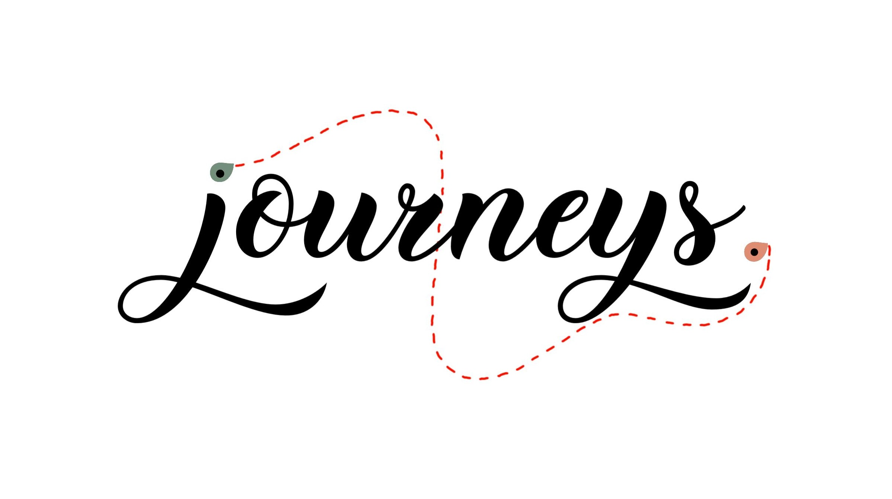

# Journeys : Find and plan your next adventure ! 🧳

***Journeys*** is a web application made for trips creation using **experience-based Points of Interest** (POIs) around Switzerland 🇨🇭 (but don't worry, more countries will come soon 🌍)

Users will be able to :

- Plan places they want to discover (at the local, cantonal or national scale) as trips, visualize and organize them as they go.
- Share their own stories by uploading pictures and redacting experiences.
- Journal their trip using our friendly dashboard and keep amazing memories forever !

Our web app is now available at [www.myjourneys.ch](https://www.myjourneys.ch) !

## Visuals - mockups

*Landing page*

Check our [detailed user guide](https://gitlab.com/pdg-journeys/journeys/-/wikis/User%20guide) and start using the app !

## Tech stack

We are using :

| Stack            | Technology          |
| ---------------- | ------------------- |
| Backend          | Spring Boot         |
| Frontend         | React               |
| Database         | Neo4j               |
| Deployment       | Docker              |
| Backend testing  |                     |
| Frontend testing | Enzyme & CodeceptJS |
| CI / CD          | GitLab CI/CD        |

Learn more about the [infrastructure](https://gitlab.com/pdg-journeys/journeys/-/wikis/infrastructure) and [pipeline](https://gitlab.com/pdg-journeys/journeys/-/wikis/pipeline).

## Contributing

Wanna contribute ? Learn more about our [workflow](https://gitlab.com/pdg-journeys/journeys/-/wikis/workflow) in the wiki and [how to contribute](https://gitlab.com/pdg-journeys/journeys/-/wikis/how-to-contribute).

Ready to code ? Find useful infos on how to setup the complete dev environment in the wiki :

- [Basics](https://gitlab.com/pdg-journeys/journeys/-/wikis/common)
- [Frontend](https://gitlab.com/pdg-journeys/journeys/-/wikis/frontend)
- [Backend](https://gitlab.com/pdg-journeys/journeys/-/wikis/backend)
- [Local deployment guide](https://gitlab.com/pdg-journeys/journeys/-/wikis/local-deployment)

## Team

Amazing projects are made by amazing people, here we are :

- Ludovic Bonzon [[@bonzonlu](https://gitlab.com/bonzonlu)]

- Rosalie Chhen [[@RosalieChhen](https://gitlab.com/RosalieChhen)]

- Emmanuel Janssens [[@EmmanuelJanssens](https://gitlab.com/EmmanuelJanssens)]

- Dalia Maillefer [[@AliceThunderWind](https://gitlab.com/AliceThunderWind)]

- Vitor Vaz Afonso [[@vitorva](https://gitlab.com/vitorva)]

Looking for help? Found a bug? Wanna chat? Contact us at journeys.lredv@gmail.com ! 

## License

Our project uses an [MIT License](https://gitlab.com/pdg-journeys/journeys/-/blob/main/LICENSE)

## Project status

As of january 2022, the project is in a deployed state and is waiting for new contributors to add amazing new features !
